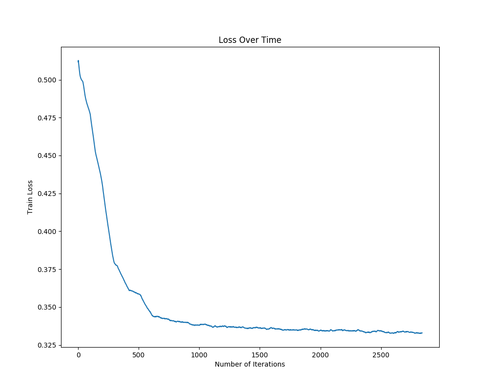
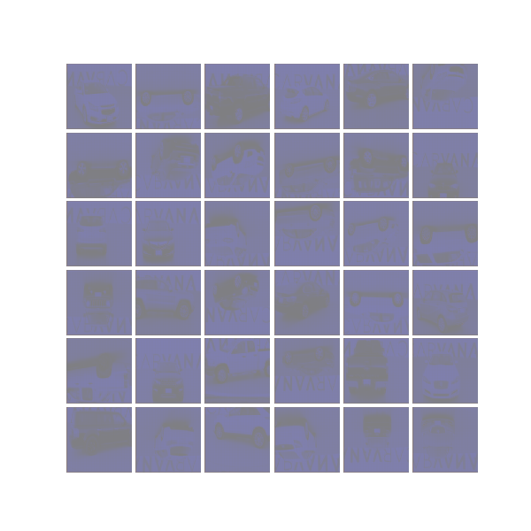

## Car Segmentation

More background info can be found [here](https://github.com/yk287/Pix2Pix_CarMask). The only difference is that instead of Pix2Pix, this repo uses UNET inspired by [paper](https://arxiv.org/pdf/1505.04597.pdf). 

## Training

Only trained the model for 20 epochs, but the results are pretty decent. 

Original Image

Masked Image

