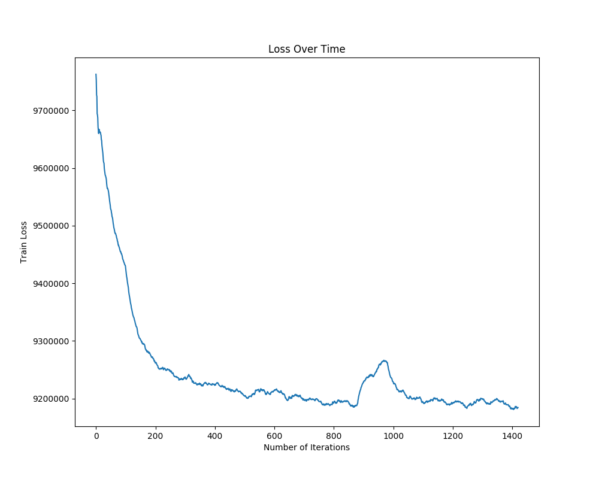
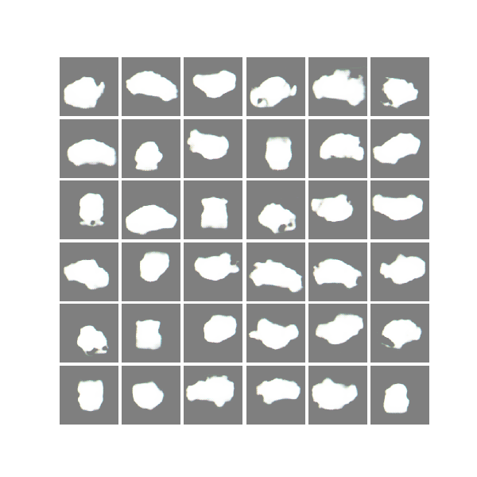
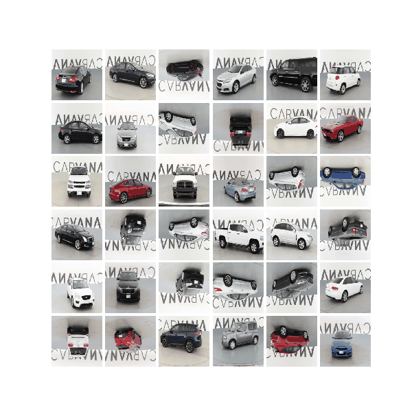

## PIX2PIX CarMask

This was inspired by a [Kaggle Challenge](https://www.kaggle.com/c/carvana-image-masking-challenge/kernels). In this competition, you’re challenged to develop an algorithm that automatically removes the photo studio background. This will allow Carvana to superimpose cars on a variety of backgrounds. You’ll be analyzing a dataset of photos, covering different vehicles with a wide variety of year, make, and model combinations.

Though I've used UNET before to takle this issue [before](https://github.com/yk287/ComputerVision_TF/tree/master/Car_Mask_TF), I thought I would try [Pix2Pix](https://arxiv.org/pdf/1611.07004.pdf) to do it as well. 

## Training

## Input and Masked images

 

