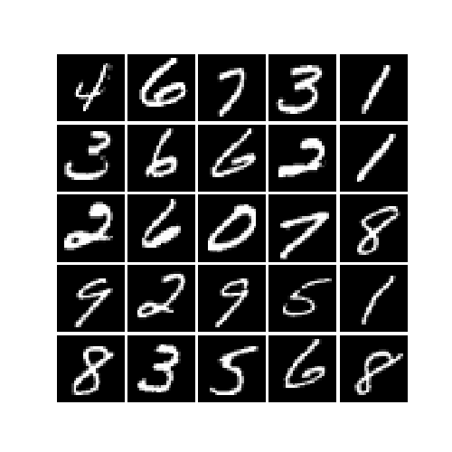

## StarGAN on MNIST dataset. 

[StarGAN](https://arxiv.org/pdf/1711.09020.pdf) algorithm applied to MNIST data to convert the digits to 8's. An easy dataset to work with before applying to a more complicated datasets such as celebA dataset used in the paper. 

## Training Progress

